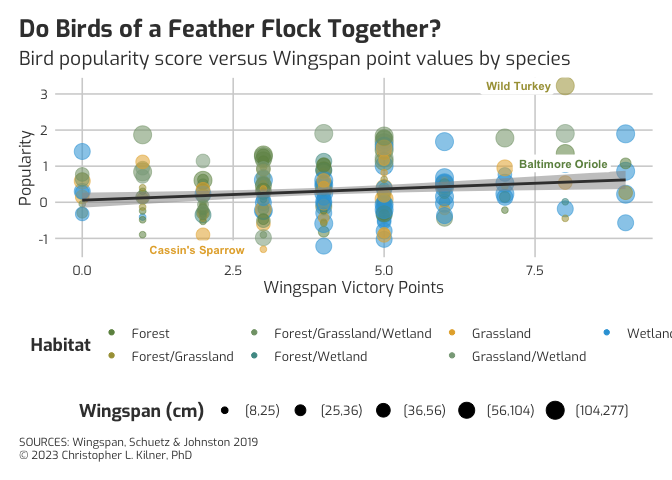

<!-- README.md is generated from README.Rmd. Please edit that file -->

# themeBCR

<!-- badges: start -->
<!-- badges: end -->

The goal of themeBCR is to … the

## Installation

You can install the development version of themeBCR from
[GitHub](https://github.com/) with:

``` r
# install.packages("devtools")
devtools::install_github("ClassicCK/themeBCR")
```

## Example

This is a basic example which shows you how to solve a common problem:

``` r
ggplot(data, aes(x = Victory.points, y = popularity, alpha = 0.2)) +
   geom_point(aes(color = Habitat, size = `Wingspan (cm)`)) +
   geom_smooth(method = "glm", se = TRUE, colour = '#3C3C3C') +
   themeBCR() +
   scale_fill_BCR(palette = "Wingspan") +
   labs(caption = "SOURCES: Wingspan, Schuetz & Johnston 2019 \n© 2023 Christopher L. Kilner, PhD",
        title = "Do Birds of a Feather Flock Together?",
        subtitle = "Bird popularity score versus Wingspan point values by species") +
   scale_alpha(guide = FALSE) +
   ylab("Popularity") +
   xlab("Wingspan Victory Points") +
   geom_label(
     data = data[data$popularity > 3 | data$popularity < -1.3 | data$Common.name == "Baltimore Oriole",],
     aes(x = Victory.points, y = popularity, color = Habitat, label = Common.name),
     fill = "white",
     size = 3,
     fontface = "bold",
     hjust = 1.151,
     label.size = NA, 
     alpha = 1,
     show.legend  = F)
#> Warning: Vectorized input to `element_text()` is not officially supported.
#> ℹ Results may be unexpected or may change in future versions of ggplot2.
#> `geom_smooth()` using formula = 'y ~ x'
#> Warning: The `guide` argument in `scale_*()` cannot be `FALSE`. This was deprecated in
#> ggplot2 3.3.4.
#> ℹ Please use "none" instead.
#> This warning is displayed once every 8 hours.
#> Call `lifecycle::last_lifecycle_warnings()` to see where this warning was
#> generated.
```


