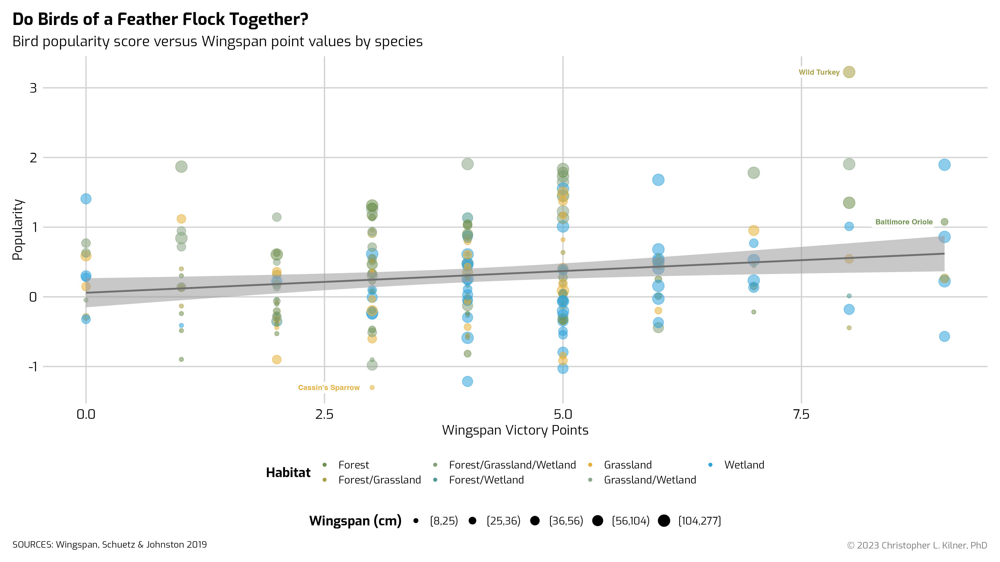

<!-- README.md is generated from README.Rmd. Please edit that file -->

# themeBCR

<!-- badges: start -->
<!-- badges: end -->

The goal of themeBCR is to … the

## Installation

You can install the development version of themeBCR from
[GitHub](https://github.com/) with:

``` r
# install.packages("devtools")
devtools::install_github("ClassicCK/themeBCR")
```

## Example

### Wingspan


